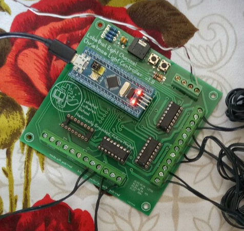
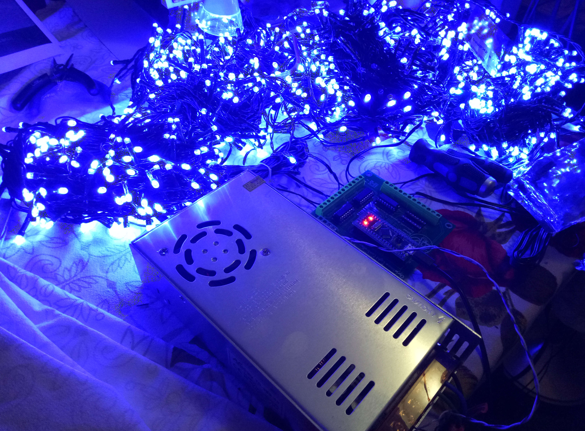
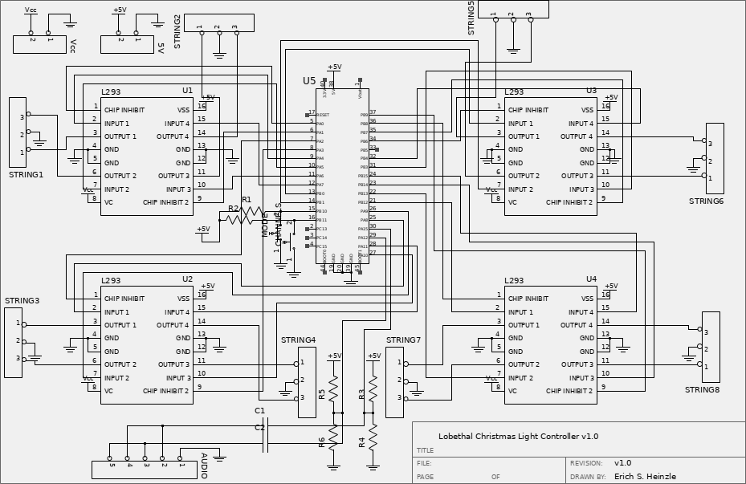

# LLS-Christmas-Light-Controller
Eight channel stm32 christmas light controller

The eight channel christmas light controller uses an stm32 "Bluepill" or similar single board computer to drive four L293D motor driver ICs to provide eight channels of control for christmas lights.

The board allows bidirectional "two-wire" LED lights to be used, with each direction treated as a channel, as well as the less common three wire LED strings which also have a ground wire.

The board requires an external power supply to drive the lighting through the L293D ICs. Most strings require 30V or 31V DC.

Suitable power supplies include benchtop laboratory power supplies, or a switch mode power supply that can be adjusted to provided the required voltage. The photograph shows a conventional 36V, 10 Amp switch mode power supply which has had its output voltage adjusted to 30V using the built in adjustment potentiometer.

The single board computer can be powered via USB, or via a 5V input terminal.

The board has two input buttons, currently used for mode selection. There is also provision for stereo audio input, but code is yet to be written to take advantage of this.

The code will build within the arduino IDE, and the resulting firmware can be loaded onto the stm32 board with either an ST-Link programmer, or via a USB to TTL serial adaptor.

Lighting modes currently supported include:

- All on
- Slow Flash
- Slow Flash with ramped brightness
- Fast Flash
- Random flash
- Light chase
- Light chase with bounce (pong)
- Light chase with ramped brightness
- Light chase with bounce (pong) with ramped brightness
- Text to Morse Code (Default text is "Lobethal Lutheran School")
- Alternating bidirectional flash

The board design files are in the hardware directory as zipped gerbers which can be used to order boards from the usual online suppliers, usually in batches of ten.

The board was designed in pcb-rnd ( www.repo.hu/projects/pcb-rnd ); the board design is licensed under the TAPR open hardware license and the layout can be modified by those keen to customise.

The schematic was designed in and can be opened in Lepton-Schematic.

Enjoy!
